# 📦 Inception of Things (IoT) - 42


Este projeto é uma introdução prática ao ecossistema **Kubernetes**, focado em provisionamento de infraestrutura, orquestração de contêineres e integração contínua usando GitOps. O objetivo é evoluir desde a configuração manual de clusters com Vagrant até a automação de deploys com K3d e Argo CD.

---

## 👨‍💻 Equipe

* **Mateus** - [@Matesant](https://github.com/Matesant)
* **Cesar** - [@cauemendess](https://github.com/cauemendess)
* **Pedro Modesto** - [@phm-aguiar](https://github.com/phm-aguiar)

---

## 🏗️ Arquitetura e Etapas de Implementação

O projeto é dividido em três fases principais de complexidade crescente. O diagrama abaixo ilustra o fluxo de cada parte:

```mermaid
flowchart TD
    %% Cores e Estilos
    classDef vagrant fill:#1563FF,stroke:#fff,stroke-width:2px,color:#fff;
    classDef k8s fill:#326ce5,stroke:#fff,stroke-width:2px,color:#fff;
    classDef gitops fill:#EF7B4D,stroke:#fff,stroke-width:2px,color:#fff;
    classDef app fill:#0db7ed,stroke:#fff,stroke-width:2px,color:#fff;

    subgraph P1 ["Parte 1: Cluster K3s com Vagrant"]
        V1([Vagrant]):::vagrant -->|Provisionamento| Server[Server Node <br> K3s Controller]:::k8s
        V1 -->|Provisionamento| Worker[Worker Node <br> K3s Agent]:::k8s
        Server <-->|Comunicação Interna| Worker
    end

    subgraph P2 ["Parte 2: Ingress e Roteamento Avançado"]
        V2([Vagrant]):::vagrant -->|Single Node| K3s_P2[K3s Server]:::k8s
        K3s_P2 --> Ingress{Ingress Controller}:::k8s
        Ingress -->|app1.com| App1[App 1]:::app
        Ingress -->|app2.com| App2[App 2 <br> 3 Replicas]:::app
        Ingress -->|default| App3[App 3]:::app
    end

    subgraph P3 ["Parte 3: K3d, Argo CD e GitOps"]
        GitHub[(GitHub Repo)] -->|Sincronização Contínua| Argo[Argo CD]:::gitops
        Argo -->|Deploy Automático| K3d[Cluster K3d local]:::k8s
        DockerHub[(Docker Hub)] -.->|Pull das Imagens v1/v2| K3d
        K3d --> DevNS[[Namespace: dev]]:::app
    end
```



## 📂 Estrutura do Repositório

```
.
├── p1/             # Setup de Server e Worker K3s com Vagrant
│   ├── confs/
│   ├── scripts/
│   └── Vagrantfile
├── p2/             # K3s Server único com Ingress e 3 aplicações web
│   ├── confs/
│   ├── scripts/
│   └── Vagrantfile
└── p3/             # Automação e GitOps com K3d e Argo CD
    ├── confs/
    └── scripts/
```