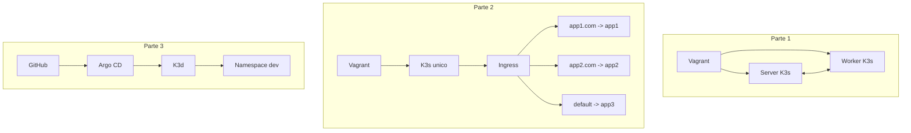
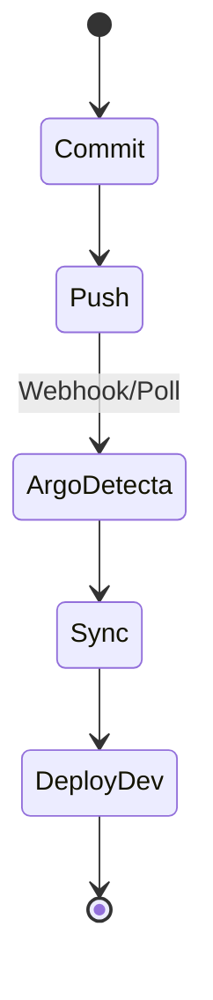
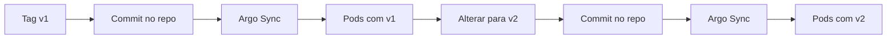

# Como Tudo Funciona

Este documento explica a arquitetura e o fluxo operacional de ponta a ponta.

## Visao geral

- p1 cria um cluster K3s com 2 VMs (controller + worker)
- p2 usa uma VM unica com K3s e Ingress para 3 apps
- p3 migra para K3d + Argo CD em abordagem GitOps

## Arquitetura por etapa

## Fluxo GitOps da p3

## Relacao entre arquivos importantes

- p1/Vagrantfile: define VMs, recursos e provisioning de server/worker
- p1/scripts/server.sh e p1/scripts/worker.sh: bootstrap do cluster p1
- p2/Vagrantfile: VM unica de p2
- p2/confs/*.yaml: manifests de apps e ingress
- p3/scripts/setup.sh: prepara k3d, namespaces e Argo CD
- p3/confs/app.yaml: Application do Argo CD
- p3/confs/project.yaml: AppProject do Argo CD
- p3/manifests/*.yaml: aplicacao monitorada via GitOps

## Variacoes de rollout por tag

Para testar versoes da imagem no p3:

- versao inicial: ajustar deployment com tag v1
- upgrade: trocar para v2 e enviar commit
- Argo CD deve sincronizar automaticamente no namespace dev

