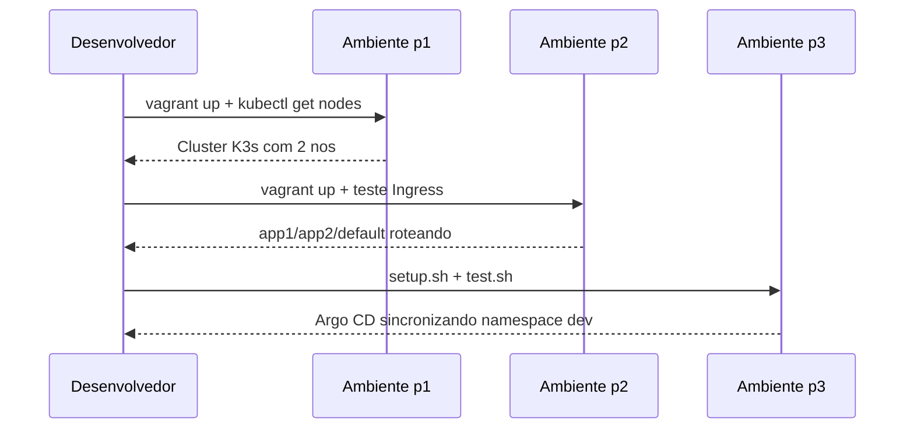

# Como Testar

Este guia concentra os testes funcionais minimos para cada parte.

## 1. Testes da p1

Entrar no server e validar cluster:

```bash
cd p1
vagrant ssh phenriq2S
ifconfig eth1
kubectl get nodes -o wide
```

Criticos:
- server com IP 192.168.56.110
- worker com IP 192.168.56.111
- ambos os nos em estado Ready

## 2. Testes da p2

Subir e verificar replicas da app2:

```bash
cd p2
vagrant up
vagrant ssh phenriq2S
kubectl get deploy app2
kubectl get ingress ingress-cool
```

Esperado:
- app2 com 3 replicas
- regras de host para app1.com e app2.com
- fallback para app3

Teste de roteamento:

```bash
curl -H "Host: app1.com" http://192.168.56.110
curl -H "Host: app2.com" http://192.168.56.110
curl http://192.168.56.110
```

## 3. Testes da p3

```bash
cd p3/scripts
./setup.sh
./test.sh
```

Validacoes essenciais:
- namespaces argocd e dev existentes
- Argo CD em execucao
- aplicacao no namespace dev com imagem tag v1 ou v2

## 4. Fluxo de teste completo



## 5. Comandos uteis de troubleshooting

```bash
# estado geral
kubectl get all -A

# eventos recentes
kubectl get events -A --sort-by=.lastTimestamp

# pods do Argo CD
kubectl get pods -n argocd

# application do Argo
kubectl get applications -n argocd
```
