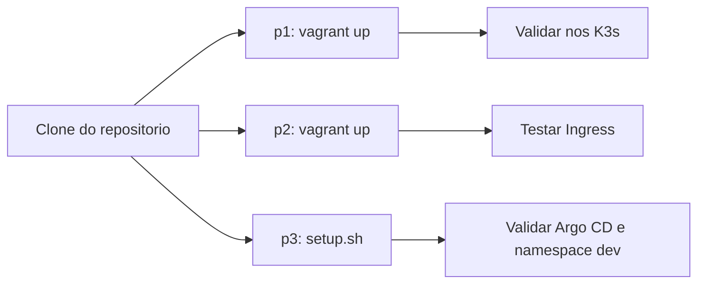

# Getting Started

Este guia ajuda voce a subir cada parte do projeto rapidamente.

## Pre-requisitos

- Linux ou macOS
- VirtualBox
- Vagrant
- kubectl
- Docker
- k3d

## Clonar e entrar no projeto

```bash
git clone git@github.com:phm-aguiar/Inception-of-Things.git
cd Inception-of-Things
```

## Parte 1 (p1)

```bash
cd p1
vagrant up
vagrant ssh phenriq2S
kubectl get nodes -o wide
```

Verificacoes esperadas:
- 2 nos no cluster (server + worker)
- IPs privados 192.168.56.110 e 192.168.56.111

## Parte 2 (p2)

```bash
cd p2
vagrant up
vagrant ssh phenriq2S
kubectl get pods -A
kubectl get ingress
```

Teste de roteamento HTTP por Host:

```bash
curl -H "Host: app1.com" http://192.168.56.110
curl -H "Host: app2.com" http://192.168.56.110
curl http://192.168.56.110
```

## Parte 3 (p3)

```bash
cd p3/scripts
./setup.sh
./test.sh
```

Acesso Argo CD (exemplo):

```bash
kubectl -n argocd port-forward svc/argocd-server 8081:443
```

## Fluxo de inicializacao


